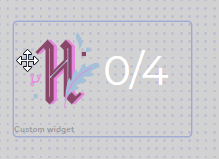

# Hacktoberfest PR counter for Stream Elements

To celebrate hacktoberfest I've created this widget to keep track of your progress, you can use it, update it, change it and do whatever you wish with it.

If you come up with some cool ideas, feel free to share them on this repo by submitting a PR.

## Installation Guide

Before using this code, you need to decide if you want to:

- Add this widget to an existing overlay
- Add this widget to an empty overlay and import it as a browser source in OBS

Once you've decided, open the overlay editor/create a new overlay and follow the steps:

- Click the button to add a new widget - the big round purple button on the bottom left of the screen with a `+`
- Choose `Static/Custom` from the menu
- Choose Custom Widget
- Inside the widget settings click `open editor`
- Replace everything inside the HTML, CSS, JS and JSON tabs with the code from this repository

## Bugs and Suggestions

This widget was created quickly, if you find any bugs or have any suggestions make sure to create a new issue or submit a PR.

Happy streaming and hacktoberfest!